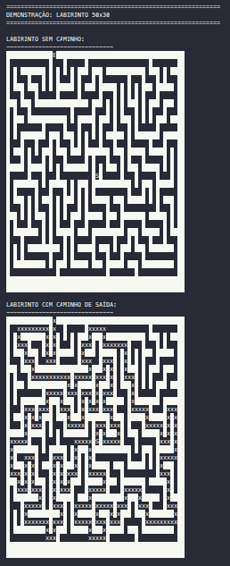

# Maze Exit Search

Método para encontrar o caminho de saída de um labirinto usando A* e DFS implementados com C++23.

## Descrição

- Geração dinâmica de labirintos com obstáculos
- Busca otimizada com algoritmo A* e DFS
- Visualização do caminho encontrado
- Benchmark de performance entre algoritmos de busca
- C++23 com otimizações

## Compilação e Execução

### Com Docker

```bash
sudo docker build -t maze-exit-search .
sudo docker run --rm maze-exit-search
```

### Com Makefile

```bash
make         # Compilar
make run     # Executar
make clean   # Limpar
make rebuild # Recompilar tudo
```

### Com CMake

```bash
mkdir -p build && cd build
cmake ..
cmake --build .
./maze-exit-search
```

## Estrutura

```
├── CMakeLists.txt
├── Makefile
├── main.cpp
├── include/          # Headers
├── src/              # Implementação
└── build/            # Saída compilada
```

## Requisitos

- g++ 11+ ou Clang 14+ (C++23)
- make ou cmake 3.10+

## Funcionalidades

- **Demonstração**: Gera labirinto 20x15 e encontra saída com A*
- **Benchmark**: Testa em 5 tamanhos diferentes de labirintos (30 execuções por tamanho para média estatística)

## Geração de Labirintos Aleatórios

### Algoritmo: Recursive Backtracking (Profundidade)

O projeto utiliza o algoritmo **Recursive Backtracking**, um método clássico para gerar labirintos aleatórios :

**Processo:**
1. Inicia na célula central do mapa
2. Marca a célula atual como caminho
3. Seleciona aleatoriamente uma de 4 direções (Norte, Sul, Leste, Oeste)
4. Move 2 células na direção escolhida
5. Se a célula vizinha é parede (não visitada):
   - Marca ambas as células intermediárias como caminho
   - Continua recursivamente da nova célula
6. Se todas as direções foram exploradas, volta ao passo anterior
7. Rastreia possíveis saídas enquanto constrói o labirinto
8. Escolhe uma saída aleatória entre as encontradas

**Características:**
- Garante um caminho conectado entre entrada e saída
- Gera labirintos com uma única solução ótima
- Representação em matriz: 0 = caminho, 1 = parede, 7 = saída

### Exemplo de Labirinto Gerado



## Resultados de Desempenho

### Análise Comparativa (Média de 30 execuções)

O projeto compara dois algoritmos de busca em labirintos de tamanhos crescentes:

| Tamanho | Área | A* (ms) | DFS (ms) | Speedup |
|---------|------|---------|----------|---------|
| 20x15   | 300  | 0.012   | 0.017    | 1.42x   |
| 30x20   | 600  | 0.036   | 0.050    | 1.39x   |
| 40x23   | 920  | 0.087   | 0.128    | 1.47x   |
| 50x30   | 1500 | 0.193   | 0.353    | 1.83x   |
| 60x35   | 2100 | 0.436   | 0.816    | 1.87x   |

### Conclusões

**A* vs DFS:**
- **Eficiência consistente**: A* mantém-se entre 1.4x e 1.9x mais rápido que DFS em todos os tamanhos
- **Escalabilidade**: Ambos os algoritmos crescem exponencialmente, mas A* cresce mais lentamente
- **Implementação heurística**: O uso de heurística euclidiana no A* demonstra redução consistente do espaço de busca

**Recomendação**: A* é o algoritmo preferível para qualquer aplicação prática, oferecendo speedup consistente com menor crescimento de complexidade.
